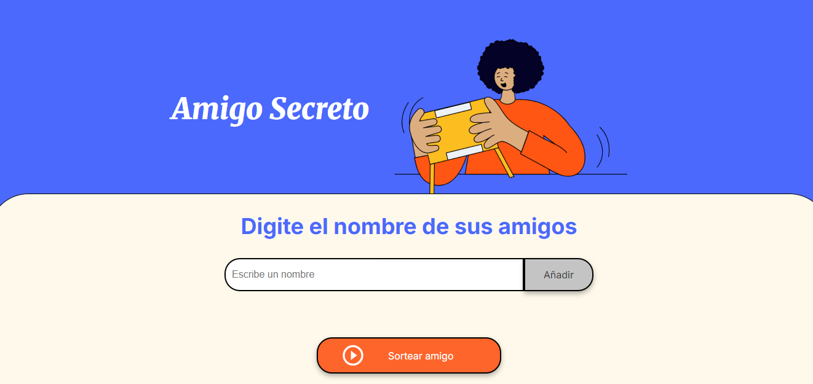

<h1 align="center"> Challenge amigo secreto </h1>

 Proyecto realizado en el contexto de la formación OracleONE. Se entrega como un challenge para aplicar lo aprendido sobre JavaScript y Git/GitHub.

 Se trata de una página web utilizada para ingresar una lista de nombres y sortear uno de ellos.

  

\## 🛠️ Funcionalidades 

<li>1. Ingresar nombres a la lista de amigos</li>
<li>2. La página chequea que el nombre no se repita ni este en blanco</li>
<li>4. Se muestra una lista de los nombres que van siendo agregados</li>
<li>5. Se realiza un sorteo random entre los nombres ingresados</li>
<li>6. También se chequea que la lista no este vacia antes de sortear</li>
<li>7. Se muestra el resultado del sorteo</li>